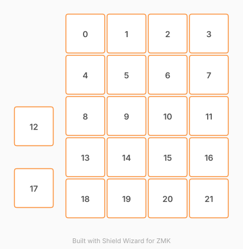

# ZMK Configuration for KnobGoblin-ZMK

ZMK firmware for a Knob Goblin macropad using a Super Mini (Nice!Nano v2 clone) microcontroller.

The Knob Goblin is using a ortholinear layout, and the keymap is targeted for use with MacOS.

Original code generate by Shield Wizard for ZMK